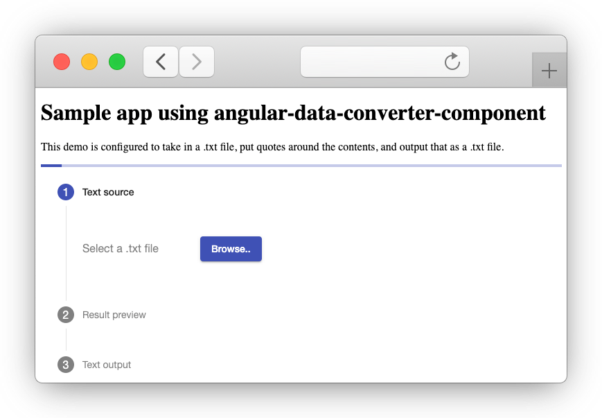

# angular-data-converter-component
An Angular component that allows users to select a file and convert it to another format (you need to pass in your own converter service).

## How to use
Read the documentation on [npmjs.com/package/angular-data-converter-component](https://www.npmjs.com/package/angular-data-converter-component).

## Example application
The prerequisites of this application are equal to the [Angular Framwork prerequisites](https://angular.io/guide/setup-local#prerequisites).

1. Clone this repository to your computer (or download as .zip)
2. Install dependencies by running `npm install`
3. Run `ng build data-converter` to build the component
4. Run `ng serve -o` to run the example. This will start a dev server and opens the application in your browser. The app will automatically reload if you change any of the source files.



---

# Documentation for maintainers

## Code scaffolding

Run `ng generate component component-name` to generate a new component. You can also use `ng generate directive|pipe|service|class|guard|interface|enum|module`.

## Build

Run `ng build` to build the project. The build artifacts will be stored in the `dist/` directory. Use the `--prod` flag for a production build.

## Running unit tests

Run `ng test` to execute the unit tests via [Karma](https://karma-runner.github.io).

## Running end-to-end tests

Run `ng e2e` to execute the end-to-end tests via [Protractor](http://www.protractortest.org/).

## Publishing library to NPM

Use the Angular CLI and the npm package manager to build and publish your library as an npm package.

Before publishing a library to NPM, build it using the --prod flag which will use the older compiler and runtime known as View Engine instead of Ivy.

```
ng build data-converter --prod
cd dist/data-converter
npm publish
```

## Further help

To get more help on the Angular CLI use `ng help` or go check out the [Angular CLI README](https://github.com/angular/angular-cli/blob/master/README.md).
